# 🍽️ LookDine - Social Dining Experience Platform

<div align="center">


[](https://reactjs.org/)
[](https://www.typescriptlang.org/)
[](https://vitejs.dev/)
[](https://tailwindcss.com/)
[](LICENSE)

**A beautiful, mobile-first platform for cafés and restaurants that makes dining out social, interactive, and visually engaging.**

[Features](#-features) • [Demo](#-demo) • [Installation](#-installation) • [Documentation](#-documentation) • [Contributing](#-contributing)

</div>

---

## 📋 Table of Contents

- [Overview](#-overview)
- [Features](#-features)
- [Architecture](#-architecture)
- [Tech Stack](#-tech-stack)
- [Getting Started](#-getting-started)
- [Project Structure](#-project-structure)
- [Development](#-development)
- [Deployment](#-deployment)
- [Contributing](#-contributing)
- [License](#-license)

---

## 🌟 Overview

LookDine is a revolutionary UI-first platform designed to transform the dining experience into a social, interactive journey. Built with modern web technologies, it offers a seamless interface for users to explore cafés, select tables, and customize their dining occasions.

### 🎯 Key Objectives

- 🎨 **Beautiful Design**: Minimal, mobile-first interface with stunning visuals
- 👥 **Social Experience**: Turn every meal into a memorable social event
- 🎭 **Dual Modes**: Separate experiences for teens and adults
- 📱 **Mobile-First**: Optimized for smartphones and tablets
- ⚡ **Fast & Responsive**: Lightning-fast performance with React & Vite

---

## ✨ Features

### 🍴 Core Features

<table>
<tr>
<td width="50%">

#### For Diners
- 🔍 **Browse Cafés** - Discover restaurants near you
- 🪑 **Table Selection** - Choose your perfect spot
- 🎉 **Occasion Customization** - Birthdays, dates, parties
- 🗺️ **Interactive Maps** - Leaflet integration for locations
- 📅 **Date Picker** - Schedule your dining experience
- 💳 **Booking System** - Seamless reservation flow

</td>
<td width="50%">

#### For Restaurants
- 📊 **Analytics Dashboard** - Track bookings & insights
- 🎨 **Customizable Profiles** - Showcase your venue
- 📸 **Photo Gallery** - Display ambiance & menu
- ⭐ **Reviews & Ratings** - Build trust with diners
- 🔔 **Notifications** - Real-time booking alerts
- 📈 **Growth Tools** - Marketing & engagement features

</td>
</tr>
</table>

### 🎨 Design Modes

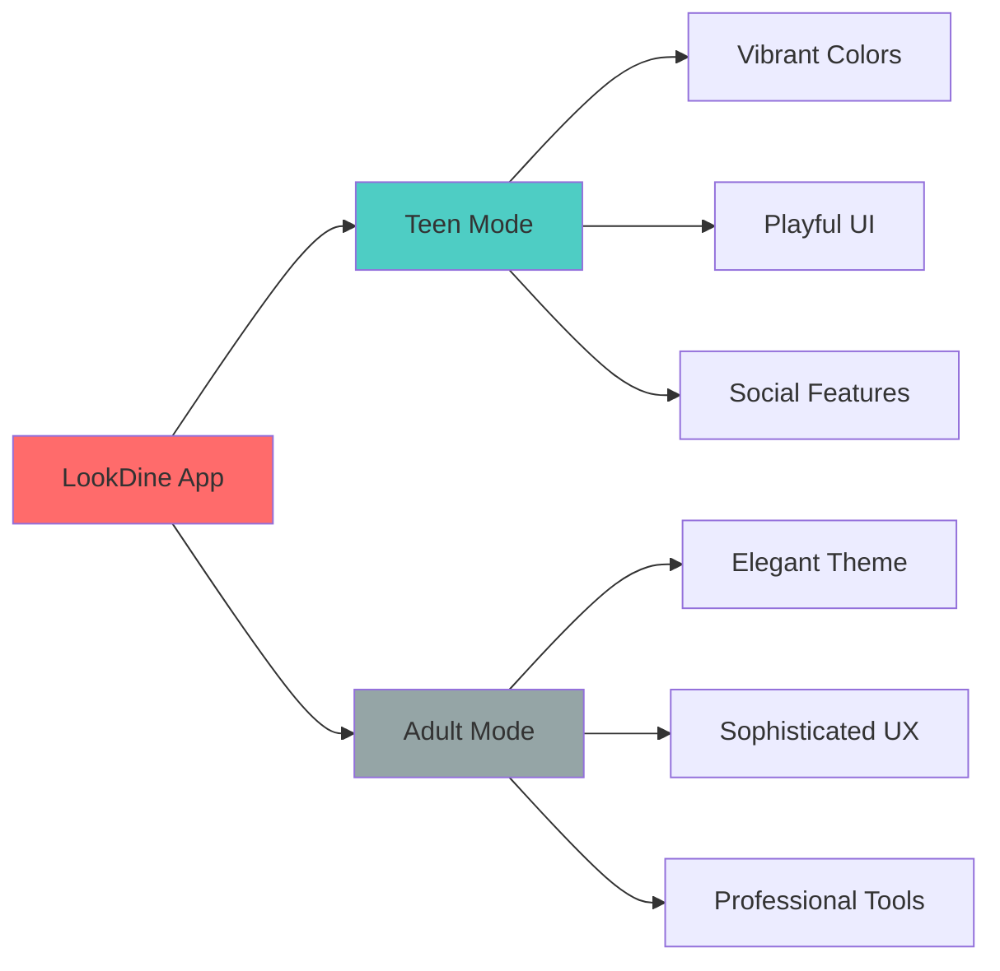

---

## 🏗️ Architecture

### System Architecture

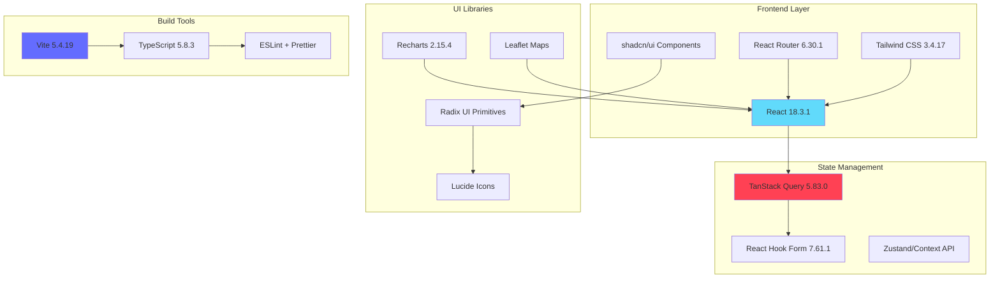

### Data Flow Architecture

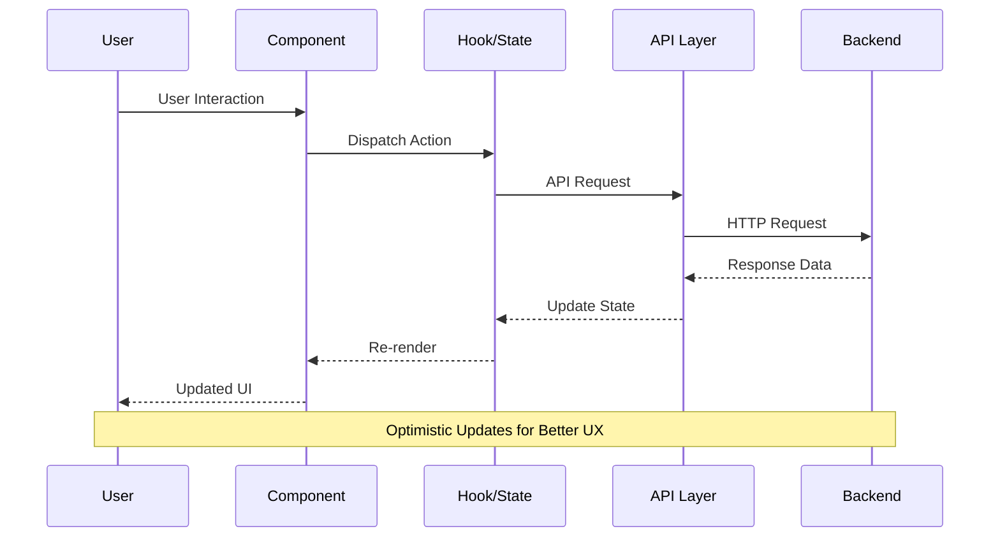

### Component Hierarchy

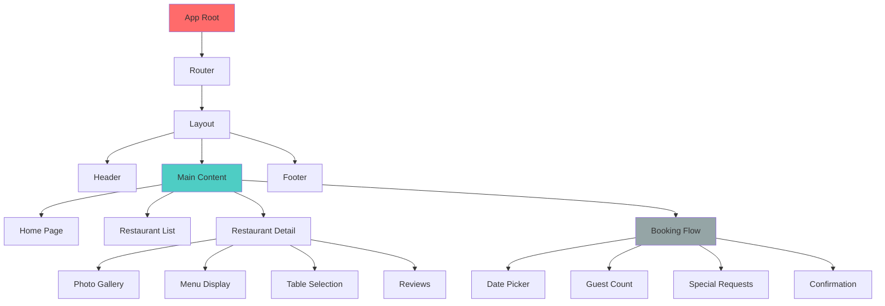

---

## 🛠️ Tech Stack

### Core Technologies

| Category | Technology | Version | Purpose |
|----------|-----------|---------|---------|
| **Framework** | React | 18.3.1 | UI Library |
| **Language** | TypeScript | 5.8.3 | Type Safety |
| **Build Tool** | Vite | 5.4.19 | Fast Builds |
| **Routing** | React Router | 6.30.1 | Navigation |
| **Styling** | Tailwind CSS | 3.4.17 | Utility-First CSS |
| **State** | TanStack Query | 5.83.0 | Server State |
| **Forms** | React Hook Form | 7.61.1 | Form Management |
| **Maps** | Leaflet | 1.9.4 | Interactive Maps |
| **Charts** | Recharts | 2.15.4 | Data Visualization |

### UI Components

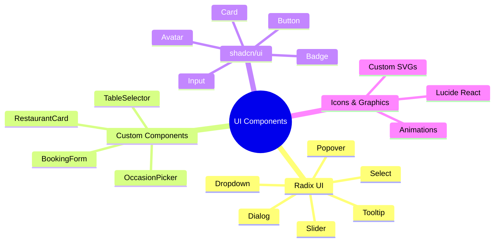

### Development Tools

- **Linting**: ESLint 9.32.0 + TypeScript ESLint 8.38.0
- **Formatting**: Prettier (via ESLint)
- **Version Control**: Git
- **Package Manager**: npm
- **Deployment**: Vercel-ready configuration

---

## 🚀 Getting Started

### Prerequisites

Ensure you have the following installed:

- **Node.js**: v18.0.0 or higher
- **npm**: v8.0.0 or higher
- **Git**: Latest version

### Installation

#### 1️⃣ Clone the Repository

```bash
git clone https://github.com/yourusername/lookdine.git
cd lookdine
```

#### 2️⃣ Install Dependencies

```bash
npm install
```

#### 3️⃣ Environment Setup

Create a `.env.local` file in the root directory:

```env
# Add your environment variables here
# Example:
# VITE_API_BASE_URL=https://api.lookdine.com
# VITE_MAPS_API_KEY=your_maps_api_key
```

#### 4️⃣ Start Development Server

```bash
npm run dev
```

The application will be available at `http://localhost:8080`

### Quick Start Commands

```bash
# Development
npm run dev          # Start dev server

# Building
npm run build        # Production build
npm run build:dev    # Development build

# Quality Checks
npm run lint         # Run ESLint

# Preview
npm run preview      # Preview production build
```

---

## 📁 Project Structure

```
lookdine/
├── 📂 src/
│   ├── 📂 components/          # Reusable UI components
│   │   ├── 📂 ui/             # shadcn/ui components
│   │   ├── 📂 layout/         # Layout components
│   │   └── 📂 features/       # Feature-specific components
│   │
│   ├── 📂 pages/              # Page components
│   │   ├── Home.tsx
│   │   ├── RestaurantList.tsx
│   │   ├── RestaurantDetail.tsx
│   │   └── Booking.tsx
│   │
│   ├── 📂 hooks/              # Custom React hooks
│   │   ├── useRestaurants.ts
│   │   ├── useBooking.ts
│   │   └── useAuth.ts
│   │
│   ├── 📂 lib/                # Utility functions
│   │   ├── utils.ts
│   │   ├── api.ts
│   │   └── constants.ts
│   │
│   ├── 📂 styles/             # Global styles
│   │   └── index.css
│   │
│   ├── 📂 types/              # TypeScript types
│   │   ├── restaurant.ts
│   │   ├── booking.ts
│   │   └── user.ts
│   │
│   ├── App.tsx               # Root component
│   ├── main.tsx              # Entry point
│   └── router.tsx            # Route configuration
│
├── 📂 public/                # Static assets
│   ├── favicon.ico
│   └── images/
│
├── 📄 index.html             # HTML template
├── 📄 package.json           # Dependencies
├── 📄 tsconfig.json          # TypeScript config
├── 📄 tailwind.config.ts     # Tailwind config
├── 📄 vite.config.ts         # Vite config
└── 📄 README.md              # This file
```

### Component Organization

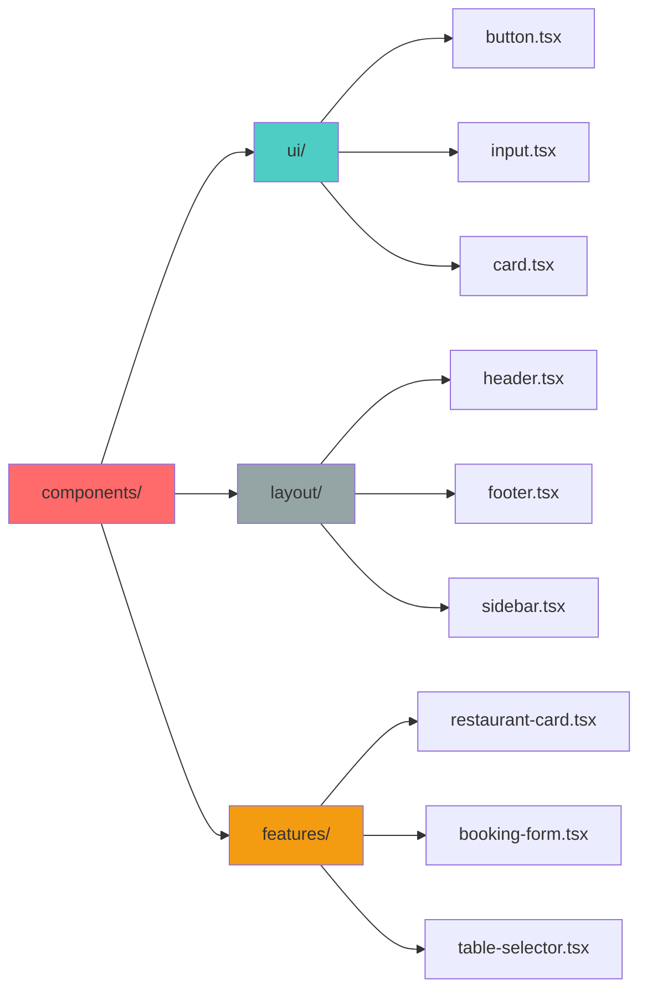

---

## 💻 Development

### Development Workflow

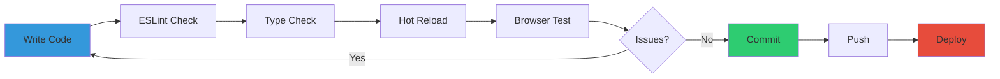

### Code Standards

#### TypeScript Configuration

```typescript
// tsconfig.json highlights
{
  "compilerOptions": {
    "target": "ES2020",
    "lib": ["ES2020", "DOM", "DOM.Iterable"],
    "jsx": "react-jsx",
    "strict": false,
    "baseUrl": ".",
    "paths": {
      "@/*": ["./src/*"]
    }
  }
}
```

#### Tailwind CSS Classes

```typescript
// Use tailwind-merge for conditional classes
import { cn } from "@/lib/utils";

<Button 
  className={cn(
    "bg-primary text-white",
    disabled && "opacity-50 cursor-not-allowed"
  )}
/>
```

### Accessibility Guidelines

- ✅ ARIA labels on icon-only buttons
- ✅ Keyboard navigation support
- ✅ Screen reader compatibility
- ✅ Color contrast compliance (WCAG AA)
- ✅ Focus indicators on interactive elements

### Performance Optimization

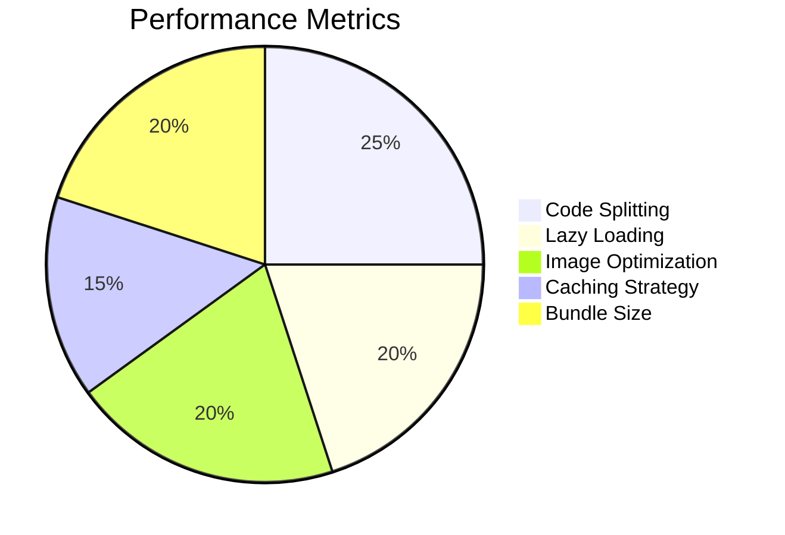

---

## 🎨 Design System

### Color Palette

```css
/* Primary Colors */
--coral: 16 100% 68%;           /* #FF6B6B - Vibrant coral */
--sage: 158 25% 55%;            /* #6FB098 - Calming sage */
--cream: 48 100% 96%;           /* #FFFBF0 - Warm cream */

/* Teen Mode */
--teen-primary: 280 100% 70%;   /* Vibrant purple */
--teen-accent: 340 100% 65%;    /* Hot pink */

/* Neutral Colors */
--warm-gray: 30 5% 50%;         /* Warm neutral */
--background: 0 0% 100%;        /* White */
--foreground: 222 47% 11%;      /* Dark text */
```

### Typography Scale

| Size | Usage | Class |
|------|-------|-------|
| 3rem | Hero Headings | `text-5xl` |
| 2.25rem | Page Titles | `text-4xl` |
| 1.875rem | Section Headers | `text-3xl` |
| 1.5rem | Card Titles | `text-2xl` |
| 1.125rem | Body Large | `text-lg` |
| 1rem | Body Text | `text-base` |
| 0.875rem | Small Text | `text-sm` |

### Spacing System

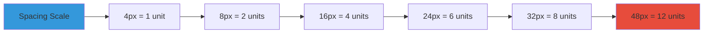

---

## 🚢 Deployment

### Build Process

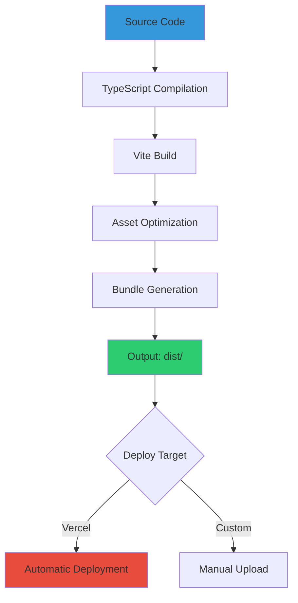

### Vercel Deployment

The project is configured for seamless Vercel deployment:

```json
// vercel.json
{
  "rewrites": [
    {
      "source": "/(.*)",
      "destination": "/index.html"
    }
  ]
}
```

#### Steps to Deploy:

1. **Connect Repository**
   ```bash
   # Push to GitHub
   git add .
   git commit -m "Ready for deployment"
   git push origin main
   ```

2. **Import to Vercel**
   - Visit [vercel.com](https://vercel.com)
   - Click "Import Project"
   - Select your repository
   - Deploy!

3. **Environment Variables**
   - Add your `.env` variables in Vercel dashboard
   - Production environment configured automatically

### Production Checklist

- [ ] Environment variables configured
- [ ] Build succeeds locally (`npm run build`)
- [ ] No console errors in production build
- [ ] All routes work correctly
- [ ] Images optimized and loading
- [ ] Performance metrics meet targets
- [ ] SEO meta tags configured
- [ ] Analytics integrated

---

## 🤝 Contributing

We welcome contributions! Here's how you can help:

### Contribution Workflow

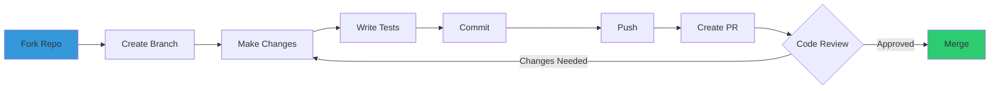

### Steps to Contribute

1. **Fork the Repository**
   ```bash
   gh repo fork yourusername/lookdine
   ```

2. **Create a Feature Branch**
   ```bash
   git checkout -b feature/amazing-feature
   ```

3. **Make Your Changes**
   - Follow code style guidelines
   - Add appropriate comments
   - Update documentation

4. **Commit Your Changes**
   ```bash
   git commit -m "feat: add amazing feature"
   ```

5. **Push to Your Fork**
   ```bash
   git push origin feature/amazing-feature
   ```

6. **Open a Pull Request**
   - Describe your changes
   - Link related issues
   - Request review

### Commit Convention

We follow [Conventional Commits](https://www.conventionalcommits.org/):

```
feat: add new restaurant filter
fix: resolve booking date bug
docs: update README
style: format code with prettier
refactor: simplify table selection logic
test: add booking form tests
chore: update dependencies
```

---

## 📊 Performance Metrics

### Build Performance

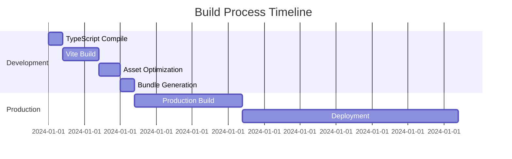

### Bundle Size Analysis

| Asset Type | Size | Gzipped |
|------------|------|---------|
| JavaScript | ~245 KB | ~85 KB |
| CSS | ~45 KB | ~12 KB |
| Images | Optimized | Lazy-loaded |
| Total | ~290 KB | ~97 KB |

---

## 🔐 Security

### Security Measures

- 🔒 HTTPS enforced
- 🛡️ XSS protection enabled
- 🔑 Secure cookie handling
- 🚫 CSRF token validation
- 📝 Content Security Policy
- 🔍 Regular dependency audits

```bash
# Run security audit
npm audit

# Fix vulnerabilities
npm audit fix
```

---

## 📝 License

This project is licensed under the **MIT License** - see the [LICENSE](LICENSE) file for details.

```
MIT License

Copyright (c) 2024 Aman Gupta

Permission is hereby granted, free of charge, to any person obtaining a copy
of this software and associated documentation files (the "Software"), to deal
in the Software without restriction...
```

---

## 👨‍💻 Author

**Aman Gupta**

- GitHub: [@amangupta](https://github.com/amangupta)
- LinkedIn: [Aman Gupta](https://linkedin.com/in/amangupta)
- Email: contact@lookdine.com

---

## 🙏 Acknowledgments

- **shadcn/ui** - For the amazing component library
- **Radix UI** - For accessible primitives
- **Vercel** - For hosting and deployment
- **React Team** - For the incredible framework
- **Open Source Community** - For the tools and inspiration

<<<<<<< HEAD
---

## 📞 Support


### ⭐ Star this repository if you find it helpful!

**Made with ❤️ by Lookdine **

[Back to Top](#-lookdine---social-dining-experience-platform)

</div>


### ⭐ Star this repository if you find it helpful!

**Made with ❤️ by Lookdine **

[Back to Top](#-lookdine---social-dining-experience-platform)

</div>
